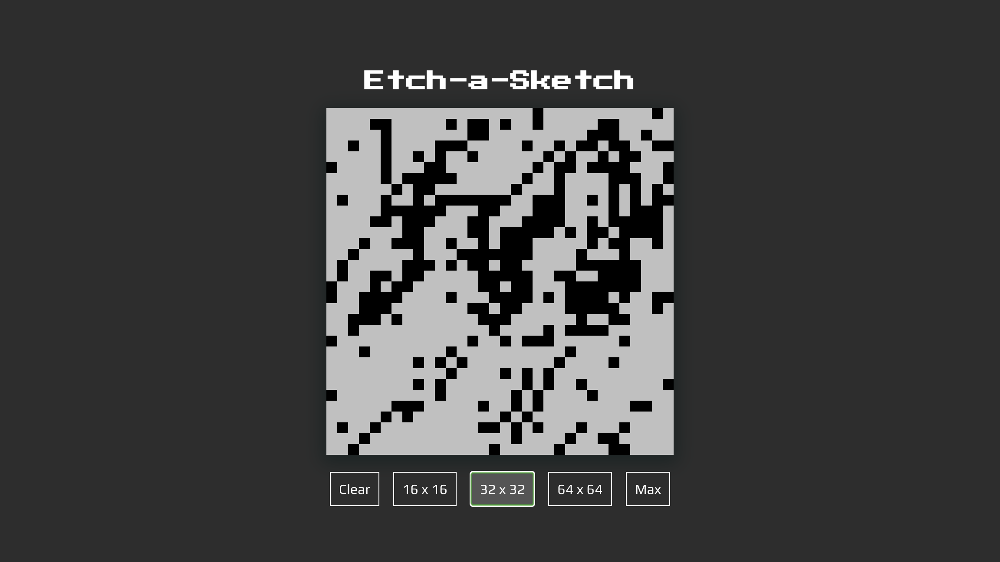

# Etch-a-Sketch Project

Part of The Odin Project's [curriculum](https://www.theodinproject.com/lessons/foundations-etch-a-sketch).

🔗 **Live preview:** [here](https://jacobrobertsdev.github.io/Etch-a-Sketch/)

## Built with

- HTML
- CSS
- Javascript
- VSCode
- Git
- Google fonts

## Author

👤 **Jacob Roberts**

- GitHub: [Jacobrobertsdev](https://github.com/jacobrobertsdev)
